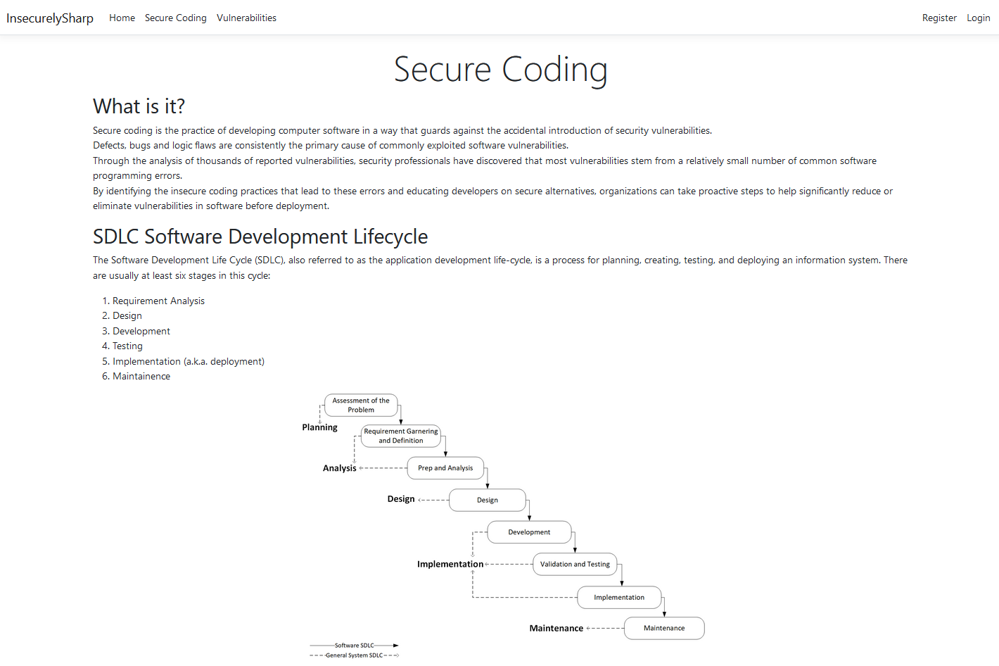

# InsecurelySharp
InsecurelySharp is my own take on Vulnerable Web Applications such as:
- [OWASP JuiceShop](https://github.com/juice-shop/juice-shop)
- [WebGoat](https://github.com/WebGoat/WebGoat)
- [DVWA](https://github.com/digininja/DVWA)
- [Mutillidae](https://github.com/webpwnized/mutillidae)

It is a fairly easily deployable MVC app written in .NET 6, covering the [2021 OWAS Top 10](https://owasp.org/www-project-top-ten/).

InsecurelySharp is aimed both at pentesters and at developers as it contains both vulnerable and non-vulnerable versions of each exercise (see the `Controllers` folder),
hopefully showcasing common pitfalls as well as good practices.

The intended usage is to share the code **without** the `Safe` suffixed functions, and let developers try fix the bugs themselves.

This is inteded for beginners as the vulnerabilites are not meant to be difficult to exploit, but to let students assimilate the core concept.

All (or most) theory is taken from the official OWASP website.

## Screenshot


## Setup
Setup should be pretty simple:
- Open `InscurelySharp.sln` in Visual Studio 
- For the `SSRF` vulnerability to work correctly:
	- Copy `SSRF_service` folder outside the application folder
	- Run a webserver on listening on `localhost` serving the dir (e.g. `cd F:\Where\You\Put\SSRF_Service; python -m http.server`) 
- Click `Run` on Visual Studio (or build and deploy to IIS)

A `Dockerfile` is also provided, I never truly tested if it worked...

## Why another Vulnerable Web App?
Why not? :)
I mainly used this as a quick-and-dirty tool to support myself while teaching and often used it in parallel with more mature labs such as Webgoat.

## Are safe functions actually safe?
They should be, if they are not I blame my incompetence in .NET and programming :).
In case of bugs feel free to open issues or suggest better/safer alternatives.

## Notes:
Those notes are from the last time this project was used, they may or may not to be considered. 
They are here for me as a reminder to look and fix if needed.

```
All issues marked with a * are dependant on the deployment and external configuration (system level protections such as permissions and executing user)

General issues:
	- upload folder should live outside the application directory 
	- * permissions should be set on all folders
	- * app should run with lowest privs as possible
	- database should live outside the application directory
	- * database should use access control
	- (TODO) separate upload/arbitray upload and path traversal (maybe do a download for pathtraversal and leave all upload issues to arbitray uploads? e.g. extension, filetype checking, zipslips, zipbombs, dos...)

Path traversal:
	- Upload functionality allows to write files outside uploads/ via a crafted filename in the request
	- (TODO) Download functionality allows download of arbitrary files 

SQLi:
	- Query action allows SQL injection via the uuid parameter
	- (TODO) Make another action which allows blind SQL injection
```